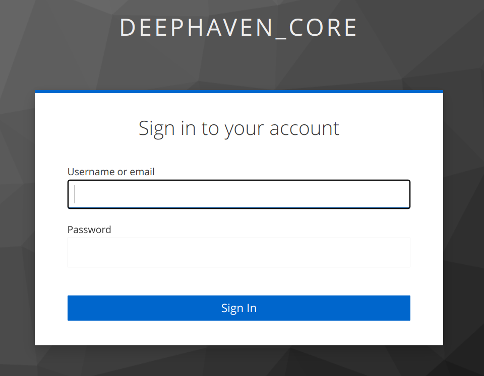

# Deephaven + Auth with Keycloak
Experiment to get the authentication layer working, inspired by these instructions:
https://github.com/deephaven/deephaven-core/tree/main/authentication/example-providers/oidc

### Run this repo
```bash
cd ~
git clone git@github.com:kzk2000/deephaven-auth.git
cd deephaven-auth
docker-compose build --no-cache
docker-compose up -d
```
The keycloak container takes 10+ sec to come up, usually all 3 containers should come up within < 20 seconds.

* To test that ODIC is working, go to http://localhost:10000/jsapi/authentication/oidc.html <br>
  Click the **Go** button and it will redirect you to the Keycloak login screen.
* Keycloak is running at hardcoded IP address 10.222.1.10:8080, a requirement so it is accessible under **the same URL** 
  * within the docker network, and
  * outside the docker network from your local web browser
* Deephaven UI runs under http://localhost:10000
  * To log in, enter **user/user** or **admin/admin** as user/password (see [deephaven_realm.json](docker/keycloak/deephaven_realm.json))
    
    <br><br>
  * To log out, hit the little wheel in the upper right of the DH UI, and you will see the logout option:
    
    <br><br>

### Prerequisite details

#### Required external .jar lib
We need [deephaven-oidc-authentication-provider-0.24.2-all.jar](https://repo1.maven.org/maven2/io/deephaven/deephaven-oidc-authentication-provider/0.24.2/deephaven-oidc-authentication-provider-0.24.2-all.jar
) which we directly downlaod into the Deephaven container during the build. 

#### Build from scratch (more for the interested folks who want to learn how to do it)
```bash
cd ~
git clone git@github.com:deephaven/deephaven-core.git
cd deephaven-core
./gradlew server-jetty-app:assemble -Poidc
```
This actually builds the entire app but we are only after 
[deephaven-oidc-authentication-provider-0.24.2-all.jar](docker/deephaven/deephaven-oidc-authentication-provider-0.24.2-all.jar)<br> 
After the gradlew built completes you would find the final .jar here:
```bash
user@user-linux:~/deephaven-core/authentication/example-providers/oidc/build/libs$ ls -la
total 7176
drwxrwxr-x 2 user user    4096 May  1 21:41 .
drwxrwxr-x 6 user user    4096 May  1 21:41 ..
-rw-rw-r-- 1 user user 7339798 May  1 21:41 deephaven-oidc-authentication-provider-0.24.2-all.jar
```


